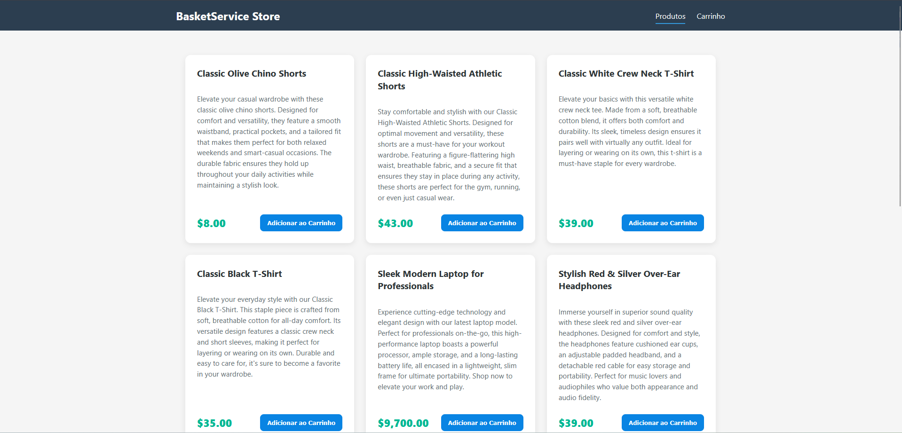

# QuickBasket

API para gerenciamento de um carrinho de compras com uso de API externa e cache (Redis), persistência em MongoDB e uma interface web moderna em Angular.

## Menu

- [Sobre o projeto](#sobre-projeto)
- [Arquitetura](#arquitetura)
- [Tecnologias](#tecnologias)
- [Configuração](#configuração)
- [Segurança](#segurança)
- [Frontend](#frontend)
- [Endpoints](#endpoints)

## Sobre o projeto

Este projeto é um sistema completo de e-commerce simplificado. O backend gerencia cestas de compras, consulta uma API externa (Platzi / EscuelaJS) para obter dados dos produtos e utiliza Redis para cache de alta performance. O frontend oferece uma interface intuitiva para navegação e compra.

### Funcionalidades principais:
- **Catálogo de Produtos**: Listagem paginada (10 itens) consumindo API externa.
- **Carrinho Inteligente**: Criação automática de cestas ou atualização de cestas existentes.
- **Segurança**: Proteção de endpoints sensíveis com Spring Security (Basic Auth).
- **Persistência**: Armazenamento robusto em MongoDB.
- **Performance**: Cache de produtos e detalhes em Redis.

## Arquitetura

O projeto segue uma arquitetura desacoplada:

- **Backend (Spring Boot)**: Camadas de Controller, Service, Repository e Client (Feign).
- **Frontend (Angular 18)**: Componentes funcionais, signals para estado e interceptors para segurança.

## Tecnologias


## Configuração

### Requisitos
- Docker e Docker-Compose
- Java 17+
- Node.js 20+

### Passo a Passo

1. **Infraestrutura**:
```bash
docker-compose up -d
```

2. **Backend**:
```bash
./mvnw clean spring-boot:run
```
A API estará em `http://localhost:8080`.

3. **Frontend**:
```bash
cd frontend
npm install
npm start
```
Acesse `http://localhost:4200`.

## Segurança

A API utiliza **Spring Security** com autenticação **Basic Auth**.
- **Endpoints Públicos**: `/products/**`, `/swagger-ui/**`, `/v3/api-docs/**`.
- **Endpoints Protegidos**: `/basket/**` (Requer autenticação).

**Credenciais Padrão (Dev):**
- **Usuário**: `user`
- **Senha**: `password`

## Frontend (Angular)

Interface moderna desenvolvida com Angular 18:
- **Listagem Paginada**: Navegação entre páginas de produtos.
- **Gestão de Carrinho**: Adição de itens com lógica de "Upsert" (Cria ou Atualiza).
- **Pagamento**: Fluxo de checkout integrado com suporte a métodos específicos (CREDIT, DEBIT, PIX).

## Endpoints Principais

### Products
- `GET /products?offset=0&limit=10` - Listar produtos (Paginado).

### Basket
- `GET /basket` - Listar cestas do usuário.
- `POST /basket` - Criar nova cesta.
- `PUT /basket/{id}/payment` - Finalizar compra.
- `PATCH /basket/{id}/clear` - Limpar itens.

---
Documentação completa disponível em: `http://localhost:8080/swagger/index.html`
